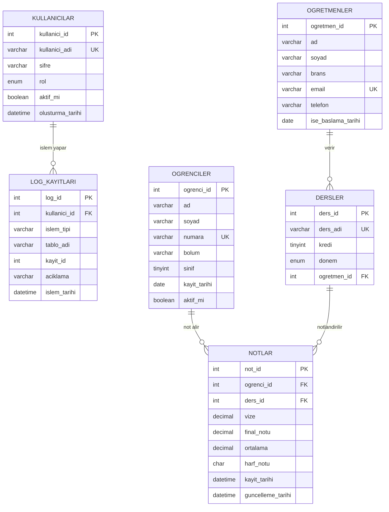
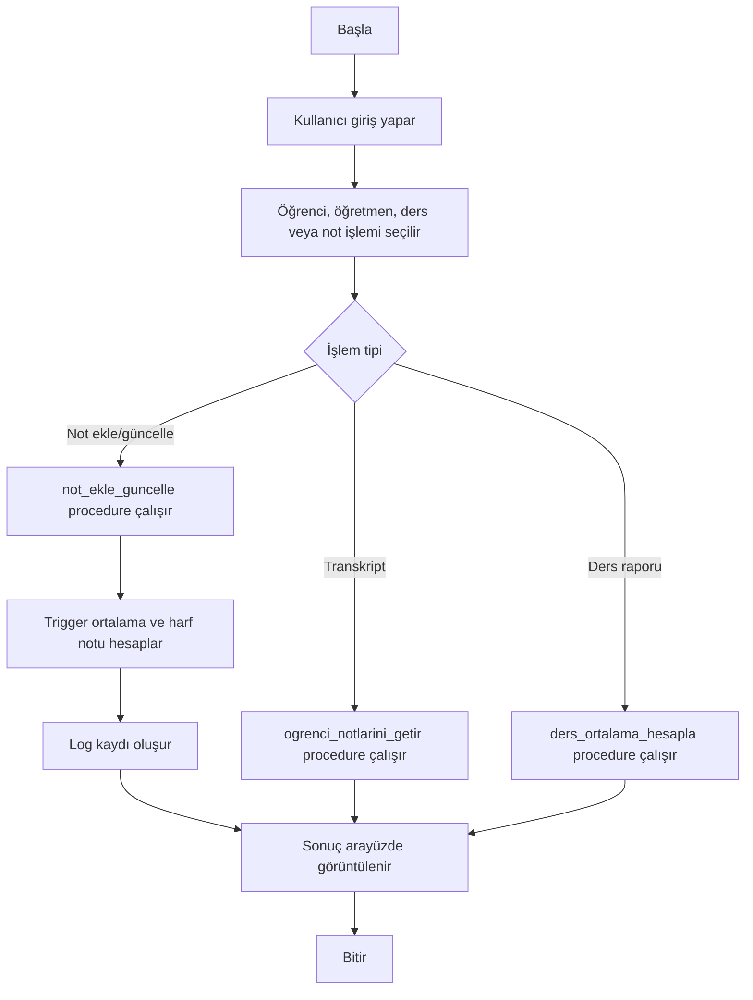

# Öğrenci Not Kayıt Sistemi

React, Express ve MySQL tabanlı öğrenci not kayıt sistemi. Projede öğrenci, öğretmen, ders ve not kayıtları için CRUD işlemleri bulunur; MySQL tarafında primary key, foreign key, unique/check/default constraint, index, view, trigger ve stored procedure yapıları proje şartnamesine uygun şekilde hazırlanmıştır.

## Kurulum

1. MySQL Workbench ile `database/ogrenci_not_sistemi_db.sql` dosyasını çalıştırın.
2. `.env` dosyasında MySQL kullanıcı bilgilerinizi kontrol edin.
3. Bağımlılıkları kurun:

```bash
npm install
```

4. API sunucusunu başlatın:

```bash
npm run server
```

5. Ayrı bir terminalde React uygulamasını başlatın:

```bash
npm run dev
```

## Giriş Bilgileri

Admin: `admin / admin`

Öğrenci: `202401034 / 123`

Öğretmen: `ayse.kaya@kocaeli.edu.tr / 123`

## Problem Tanımı

Bu proje, öğrencilerin derslere ait vize ve final notlarını kaydetmek, not ortalamasını ve harf notunu otomatik hesaplamak, ders başarı durumlarını raporlamak ve yapılan işlemleri loglamak için geliştirilmiştir.

## Yapılan Araştırmalar

Proje geliştirilirken MySQL üzerinde veri bütünlüğü sağlayan constraint yapıları, not ortalaması hesaplamasını otomatikleştiren trigger kullanımı, tekrar eden sorguları merkezi hale getiren stored procedure yapıları ve raporlama için view kullanımı araştırılmıştır. Ayrıca öğrenci-ders-not ilişkisini doğru modellemek için bire çok ilişkiler, foreign key davranışları, unique kısıtları ve normalizasyon kuralları incelenmiştir.

## Geliştirme Ortamı

- Veritabanı: MySQL 8.x
- Backend: Express.js
- Frontend: React + Vite
- Diyagram aracı: MySQL Workbench EER Diagram
- SQL betiği: `database/ogrenci_not_sistemi_db.sql`
- Teslim SQL dosyası: `grupno_sql_betikleri.txt`

## Veritabanı Yapısı

Projede 6 ana tablo vardır:

- `kullanicilar`: Sisteme giriş yapan admin, öğrenci ve öğretmen hesaplarını tutar.
- `ogretmenler`: Derslerden sorumlu öğretmen bilgilerini tutar.
- `ogrenciler`: Öğrenci kimlik, numara, bölüm ve sınıf bilgilerini tutar.
- `dersler`: Ders adı, kredi, dönem ve öğretmen ilişkisini tutar.
- `notlar`: Öğrenci-ders bazında vize, final, ortalama ve harf notunu tutar.
- `log_kayitlari`: Veritabanı işlemlerini izlemek için log kaydı tutar.

## Veri Tabanı Diyagramı

`ogretmenler` tablosu `dersler` tablosuna bire çok bağlıdır. Bir öğretmen birden fazla ders verebilir.

`ogrenciler` tablosu `notlar` tablosuna bire çok bağlıdır. Bir öğrencinin farklı derslerden birden fazla not kaydı olabilir.

`dersler` tablosu `notlar` tablosuna bire çok bağlıdır. Her not kaydı tam olarak bir öğrenciye ve bir derse bağlıdır.

`kullanicilar` tablosu `log_kayitlari` tablosuna bire çok bağlıdır. Sistemde işlem yapan kullanıcı bilgisi log kayıtlarında izlenebilir.

MySQL Workbench üzerinde aynı diyagram `database/ogrenci_not_sistemi_db.sql` çalıştırıldıktan sonra `Database > Reverse Engineer` adımıyla üretilebilir.



## Kullanılan Veritabanı Yapıları

- Primary Key: Tüm tablolarda vardır.
- Foreign Key: `dersler`, `notlar`, `log_kayitlari` tablolarında vardır.
- Unique: `kullanici_adi`, `email`, `numara`, `ders_adi`, `ogrenci_id + ders_id`.
- Check: Not aralıkları, kredi aralığı, sınıf aralığı, email formatı ve aktiflik alanları için vardır.
- Default: Rol, aktiflik, tarih, dönem, not ve harf notu alanlarında vardır.
- Index: Performans için birden fazla özel index eklenmiştir.
- View: `ogrenci_not_ortalamalari`, `basarisiz_ogrenciler`, `ders_bazli_basarilar`, `ogrenci_transkriptleri`.
- Trigger: Not hesaplama, silme kontrolü ve tüm ana tablolarda loglama için birden fazla trigger vardır.
- Stored Procedure: Öğrenci ekleme, not hesaplama, not ekleme/güncelleme, öğrenci notları ve ders ortalaması için procedure vardır.

## Akış Şeması



## Yazılım Mimarisi

`server/config/database.js` MySQL bağlantı ayarlarını `.env` üzerinden okur.

`server/server.js` Express API route’larını içerir ve tüm sorguları parametreli şekilde çalıştırır.

`src/services/api.js` React tarafındaki tüm API isteklerini tek noktadan yönetir.

`src/components/AdminPanel.jsx` öğrenci, öğretmen ve ders CRUD işlemlerini MySQL API’ye bağlar.

`src/components/TeacherPanel.jsx` not ekleme, güncelleme ve silme işlemlerini MySQL API’ye bağlar.

`src/components/StudentPanel.jsx` ders ve not listelerini API’den okur; API kapalıysa mevcut demo veriyle çalışmaya devam eder.

## Genel Yapı

Sistem üç ana katmandan oluşur. React arayüzü kullanıcı işlemlerini alır, Express API bu işlemleri güvenli ve parametreli SQL sorgularıyla veritabanına iletir, MySQL katmanı ise constraint, trigger, procedure ve view yapılarıyla iş mantığının önemli bölümlerini yönetir. Bu yapı sayesinde öğrenci, öğretmen, ders ve not kayıtları tutarlı biçimde saklanır; not ortalaması otomatik hesaplanır; yapılan işlemler log tablosunda izlenebilir.

## Arayüz Görseli

Uygulama çalıştırıldıktan sonra yönetici panelinde öğrenci, öğretmen ve ders kayıtları; öğretmen panelinde not işlemleri; öğrenci panelinde ise ders ve not görüntüleme ekranları görülebilir.

## Test Verileri

SQL betiği her ana tablo için en az 10 anlamlı test verisi içerir. Triggerlar çalıştığı için `log_kayitlari` tablosunda da sistem ve işlem kayıtları oluşur.

## Değerlendirme Kontrol Listesi

- Minimum 5 tablo: Sağlandı.
- En az 3 ilişkili tablo: Sağlandı.
- 5N ve normalizasyon ilkelerine uygun tasarım: Sağlandı.
- PK, FK, Unique, Check, Default constraints: Sağlandı.
- Her tablo için en az 10 test verisi: Sağlandı.
- Birden fazla index: Sağlandı.
- Birden fazla view: Sağlandı.
- Birden fazla trigger: Sağlandı.
- Birden fazla stored procedure: Sağlandı.
- ER diyagramı: README içinde Mermaid olarak verildi; MySQL Workbench ile `Database > Reverse Engineer` üzerinden de üretilebilir.

## Referanslar

- MySQL 8.0 Reference Manual: Constraints, Views, Triggers, Stored Procedures.
- TBL331 Veritabanı Yönetim Sistemleri 2025-2026 Bahar Dönem Projesi dokümanı.
